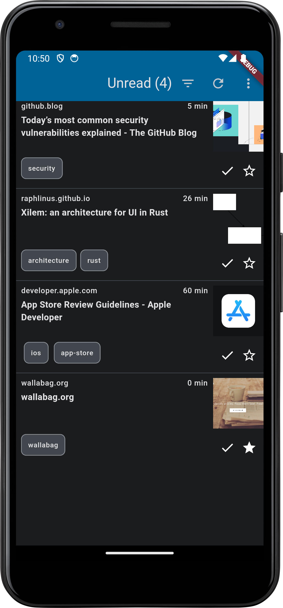

# frigoligo

Frigoligo is an universal [Wallabag](https://wallabag.org/) client made with [Flutter](https://flutter.dev/).
It is made to be 'a lot of super-cool marketing things' but for now it is mainly made with love. And that's something.

Feel free to use a [TestFlight slot](https://testflight.apple.com/join/nYnbySd8) (iOS and macOS) or to grab the APK in the [latest release](/releases/latest/download/frigoligo-release.apk.zip). Windows and Flatpak builds should be available in a not so far future too.

A full history of changes is available in [CHANGELOG.md](./CHANGELOG.md).

|Android|macOS|Android (dark)|
|:-:|:-:|:-:|
||||

Licensed under the MIT License. See [LICENSE](./LICENSE) for details.
