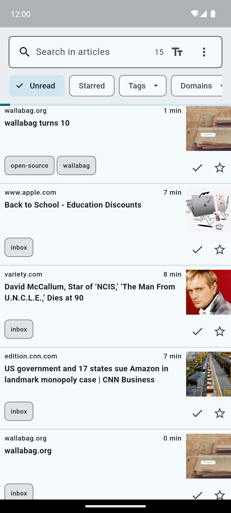

# Frigoligo

[](https://matrix.to/#/#frigoligo:one.ems.host)
[](https://hosted.weblate.org/engage/frigoligo/)

Frigoligo is a [wallabag](https://wallabag.org/) client crafted using [Flutter](https://flutter.dev/). Its core philosophy is to prioritize pragmatism and adhering to best practices when it makes sense.

Frigoligo is aiming at being:

1. **KISS**: Keep It Simple, Stupid. It should feel light and functional.
2. **Universal**: Provides a consistent experience on Android, iOS, macOS, Linux and Windows.
3. **Pluggable**: Can be integrated into any workflows easily, using deep links and OS integrations.
4. **Offline first**: Works offline as much as possible and keep synchronization efficient.
5. **Innovative**: Experiment with new ideas on top of the solid backend that is wallabag.

## Installation

[](https://apps.apple.com/us/app/frigoligo/id6451362294) [](https://play.google.com/store/apps/details?id=net.casimirlab.frigoligo) [](https://f-droid.org/fr/packages/net.casimirlab.frigoligo/) [](https://apt.izzysoft.de/fdroid/index/apk/net.casimirlab.frigoligo)

You can also download the installer from the [latest release](https://github.com/casimir/frigoligo/releases/latest) for the following platforms: Android (apk), Linux, AppImage and Windows.

## Features

Missing but planned feature are tracked in the [issues](https://github.com/casimir/frigoligo/issues?q=is%3Aissue+is%3Aopen+label%3A"missing+feature").

A full history of changes is available in [CHANGELOG.md](./CHANGELOG.md).

## Screenshots

|                                                   Mobile                                                    |                         Desktop                         |                                                         Mobile (dark)                                                          |
|:-----------------------------------------------------------------------------------------------------------:|:-------------------------------------------------------:|:------------------------------------------------------------------------------------------------------------------------------:|
|  |  |  |

## Deeplinks

Frigoligo supports a few deeplinks that allows it to be integrated in external workflows. All platforms except Linux are supported.

### Links format

Deeplinks are based on a custom scheme, the URI path is used to determine the action to perform.

The follow link will open the app and perform the `action` action with the given parameters `param1` (`hello`) and `param2` (`Günther`). Note that the host `x` is just here for readability and is ignored.

```
frigoligo://x/action?param1=hello&param2=G%C3%BCnther
```

### Actions

#### `/articles/:articleId`

Open the article with the given ID respecting the correct app navigation mode.

| Parameter   | Description                             | Required |
|-------------|-----------------------------------------|----------|
| `articleId` | The wallabag ID of the article to open. | Yes      |

#### `/login`

Open the login page and prefills the given credentials. Be aware that such link in the wild weakens the security of your account.

| Parameter      | Description                  | Required |
|----------------|------------------------------|----------|
| `server`       | Your wallabag server URL.    | No       |
| `clientId`     | Your wallabag client ID.     | No       |
| `clientSecret` | Your wallabag client secret. | No       |
| `username`     | Your wallabag username.      | No       |
| `password`     | Your wallabag password.      | No       |

### `/logs`

Open the log console. Useful to debug issues when the application is soft lock.

#### `/save`

Save a new article. This is super useful to integrate article saving from an external workflow.

| Parameter | Description                     | Required |
|-----------|---------------------------------|----------|
| `url`     | The URL of the article to save. | Yes      |

## License

Licensed under the MIT. See [LICENSE](./LICENSE) for details.

## Translations

You can help translating Frigoligo in your language by using [Weblate](https://hosted.weblate.org/engage/frigoligo/). Please come and help!

[](https://hosted.weblate.org/engage/frigoligo/)
